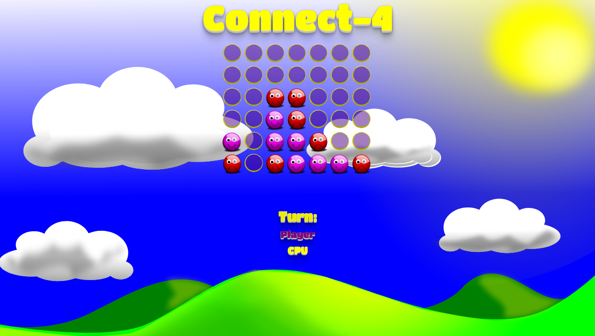

# Connect-4
---

## Description
This code is a single page desktop and mobile friendly app for playing Connect-4,
a popular two player game where each player tries to connect four tokens
in a row (horizontally, vertically, or diagonally).  Connect-4 is a game of so-called "perfect information" so the game engine is implemented via application
of the Minimax Algorithm.  Further description of the app can be found on my personal
website in the link below.
<br>



## Author: Chad McKee
* <a href="https://github.com/chadm9">GitHub</a>
* <a href="http://wchadmckee.com/">Personal Website</a>
* <a href="https://www.linkedin.com/in/w-chad-mckee-88939163/">LinkedIn</a>

## Languages and Technologies used
* JavaScript
* jQuery
* HTML
* CSS


## Dependencies and Plugins
* Bootstrap
* Google Fonts

## App Landing Page
* <a href="http://wchadmckee.com/Connect-4/">Play Connect-4 here!</a>


## Code Snippets

### The Minimax Algorithm with alpha-beta pruning
The following code snippet demonstrates the game's implementation of the Minimax algorithm with alpha-beta pruning.  
<br>
```JavaScript
    function minimax(board, availableMoves, depth, alpha, beta, maximizer) {
        
        var bestValue;
        //Check if the player or cpu has won the game and assign
        //a point value to the game state accordingly.
        var currentValue = evaluateState(board);
        if (currentValue === 1000 || currentValue === -1000) {
            return currentValue;
        }

        //If no moves remain, and no one has won, the game is tied.
        if (availableMoves.length === 0) {
            return 0;
        }
        //If the maximum recursion depth has been reached, call a heuristic
        //function to assign a score to the game state based on who is ahead.
        if(depth === 0){
            return heuristic(board);
        }

        //Find the best move available from the perspective of the cpu.  This
        //This corresponds to locating the game state with the highest score.
        if (maximizer) {
            bestValue = -10000;
            for (var i = 0; i < availableMoves.length; i++) {
                var boardCopy = copyBoard(board);
                var availableMovesCopy = copyAvailableMoves(availableMoves);
                updateBoard(boardCopy, availableMovesCopy[i], availableMovesCopy, false);
                bestValue = Math.max(minimax(boardCopy, availableMovesCopy, depth - 1, alpha, beta, !maximizer), bestValue);
                alpha = Math.max(bestValue, alpha);
                if(beta <= alpha){
                    break;
                }

            }
            return bestValue;
        }
        
        //Find the best move available from the perspective of the player.  This
        //This corresponds to locating the game state with the lowest score.
        else{
            bestValue = 10000;
            for (var i = 0; i < availableMoves.length; i++) {
                var boardCopy = copyBoard(board);
                var availableMovesCopy = copyAvailableMoves(availableMoves);
                updateBoard(boardCopy, availableMovesCopy[i], availableMovesCopy, true);
                bestValue = Math.min(minimax(boardCopy, availableMovesCopy, depth - 1, alpha, beta, !maximizer), bestValue);
                beta = Math.min(bestValue, beta);
                if(beta <= alpha){
                    break;
                }
            }
            return bestValue;
        }

    }
  ```
# Connect-4
